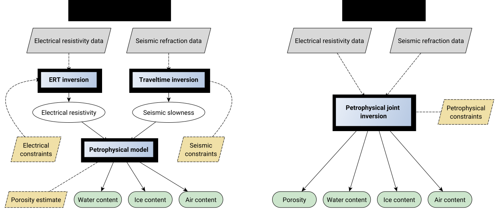

## Imaging of water, ice, and air in permafrost systems through petrophysical joint inversion of seismic refraction and electrical resistivity data

by Florian Wagner, Coline Mollaret, Thomas Günther, Andreas Kemna, and Christian Hauck

---

**This repository contains the data and code to reproduce all results and figures published in the following paper:**

> Wagner, F. M., Mollaret, C., Günther, T., Kemna, A., & Hauck, C. (2019). Quantitative imaging of water, ice, and air in permafrost systems through petrophysical joint inversion of seismic refraction and electrical resistivity data. Geophysical Journal International,  219, 1866-1875, [doi:10.1093/gji/ggz402](https://doi.org/10.1093/gji/ggz402).

*The code realizes both conventional and petrophysical joint inversion of seismic refraction and electrical resistivity data as schematically shown above.*

## Abstract

Quantitative estimation of pore fractions filled with liquid water, ice, and air
is crucial for a process-based understanding of permafrost and its hazard
potential upon climate-induced degradation. Geophysical methods offer
opportunities to image distributions of permafrost constituents in a
non-invasive manner. We present a method to jointly estimate the volumetric
fractions of liquid water, ice, air, and the rock matrix from seismic refraction
and electrical resistivity data. Existing approaches rely on conventional
inversions of both data sets and a suitable a-priori estimate of the porosity
distribution to transform velocity and resistivity models into estimates for the
four-phase system, often leading to non-physical results. Based on two synthetic
experiments and a field data set from an Alpine permafrost site (Schilthorn,
Bernese Alps, Switzerland), it is demonstrated that the developed petrophysical
joint inversion provides physically plausible solutions, even in the absence of
prior porosity estimates. An assessment of the model covariance matrix for the
coupled inverse problem reveals remaining petrophysical ambiguities, in
particular between ice and rock matrix. Incorporation of petrophysical a-priori
information is demonstrated by penalizing ice occurrence within the first two
meters of the subsurface where the measured borehole temperatures are positive.
Joint inversion of the field data set reveals a shallow air-rich layer with high
porosity on top of a lower-porosity subsurface with laterally varying ice and
liquid water contents. Non-physical values (e.g., negative saturations) do not
occur and estimated ice saturations of 0-50% as well as liquid water saturations
of 15-75% are in agreement with the relatively warm borehole temperatures
between -0.5 °C and 3 °C. The presented method helps to improve quantification
of water, ice, and air from geophysical observations.

## Structure of this repository

All source code used to generate the results and figures in the paper are in the
`code` folder. A Python library holds the important bits and pieces, which are
resued for calculations and figure generation run in Python scripts. The field
data used in this study are provided in the `data` folder and the sources for
the manuscript text and figures  (LaTeX) are in `manuscript`. See the
`README.md` files in each directory for a full description.

## Getting the code

You can download a copy of all the files in this repository by cloning the
[git](https://git-scm.com/) repository:

    git clone https://github.com/florian-wagner/four-phase-inversion.git

or [download a zip archive](https://github.com/florian-wagner/four-phase-inversion/archive/master.zip).

## Dependencies

You'll need a working Python environment on a Linux machine to run the code.
Other operating systems are generally possible, but have not been tested. The
recommended way to set up your environment is through the [Anaconda Python
distribution](https://www.anaconda.com/download/) which provides the `conda`
package manager. Anaconda can be installed in your user directory and does not
interfere with the system Python installation. The required dependencies are
specified in the file `environment.yml`.

We use `conda` virtual environments to manage the project dependencies in
isolation. Thus, you can install our dependencies without causing conflicts with
your setup (even with different Python versions).

Run the following command in the repository folder (where `environment.yml` is
located) to create a separate environment and install all required dependencies
in it:

    conda env create

## Reproducing the results

Before running any code you must activate the conda environment:

    conda activate four-phase-inversion

This will enable the environment for your current terminal session.
Any subsequent commands will use software that is installed in the environment.

To build the software, produce all results and figures, and compile
the manuscript PDF, run this in the top level of the repository:

    make all

If all goes well, the manuscript PDF will be placed in `manuscript/output`.

You can also run individual steps in the process using the `Makefile`s from the
`code` and `manuscript` folders. See the respective `README.md` files for
instructions.

## Quick example combining the steps above

    unset PYTHONPATH # to avoid conflicts with packages outside the conda env
    git clone https://github.com/florian-wagner/four-phase-inversion.git
    cd four-phase-inversion
    conda env create
    conda activate four-phase-inversion
    cd code
    make build
    make all

## License

All source code is made available under a BSD 3-clause license. You can freely
use and modify the code, without warranty, so long as you provide attribution
to the authors. See `LICENSE.md` for the full license text.

The manuscript itself is an Open Access article distributed under the terms of
the Creative Commons Attribution License
(http://creativecommons.org/licenses/by/4.0/), which permits unrestricted reuse,
distribution, and reproduction in any medium, provided the original work is
properly cited.

## Credits

The software implementation is based on [pyGIMLi](https://www.pygimli.org) (and
its dependencies), which would not exist without the dedication of Carsten
Rücker. This repository is heavily inspired by a [template for
reproducible research papers](https://www.leouieda.com/blog/paper-template.html)
by Leonardo Uieda.

## Note on branches
The `master` branch is compatible with the latest pyGIMLi version. In the `paper` branch, you will find the original version published with the above-mentioned paper.
